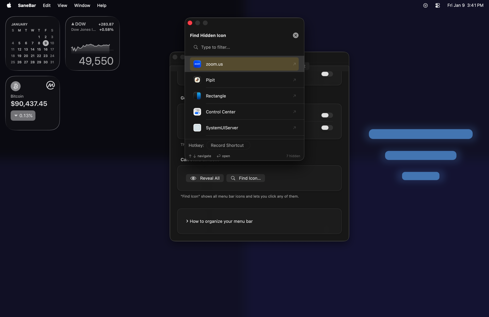
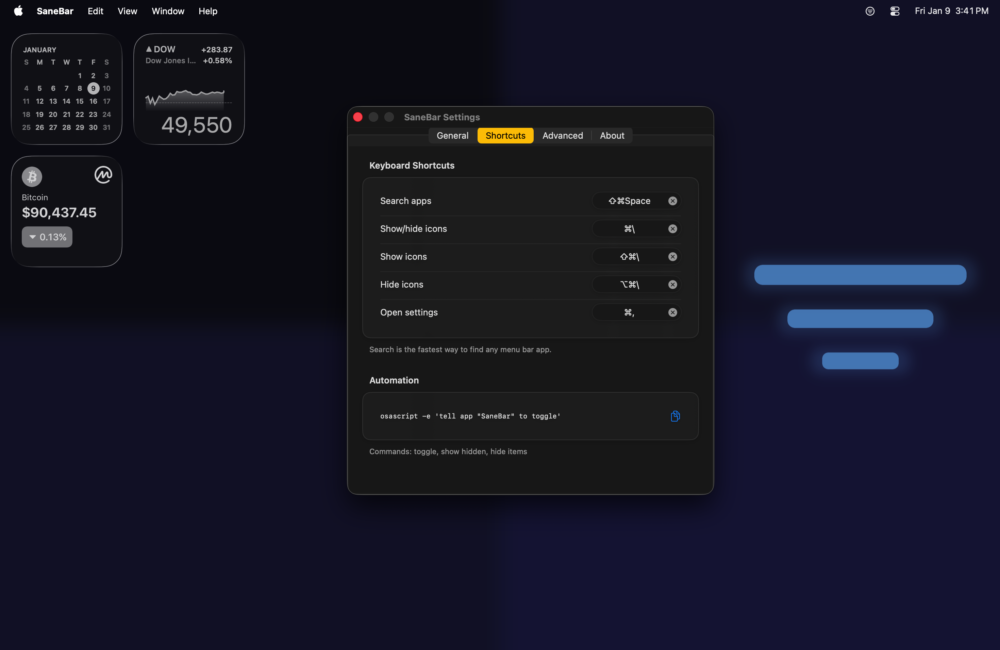
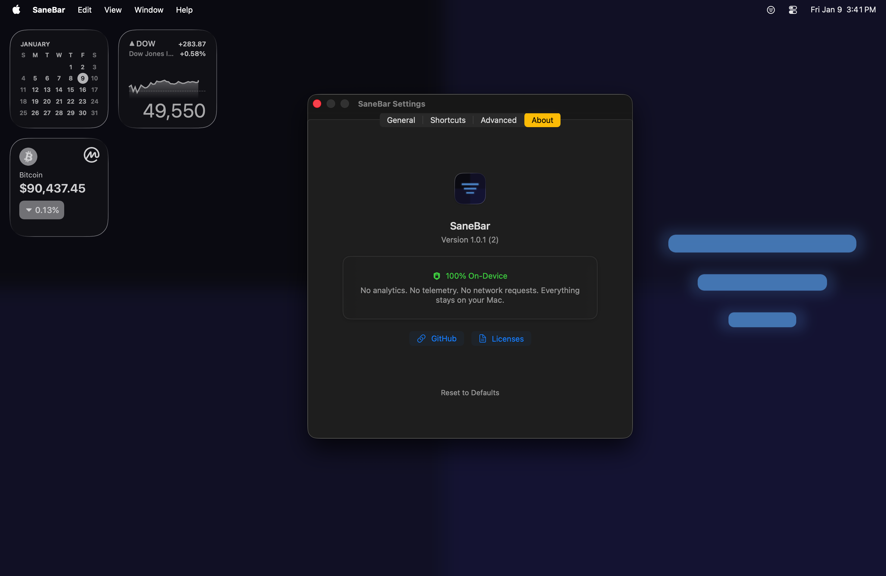

# SaneBar

[](LICENSE)
[](https://github.com/stephanjoseph/SaneBar/releases)
[](https://github.com/stephanjoseph/SaneBar/releases)
[](PRIVACY.md)
[](https://claude.ai)

**The privacy-first menu bar manager for macOS.** Native, lightweight, and scriptable.

Hide clutter. Lock sensitive icons behind Touch ID. Find any app instantly.



| Before | After |
|--------|-------|
|  |  |

---

## Download

**[Download SaneBar v1.0.3](https://github.com/stephanjoseph/SaneBar/releases/download/v1.0.3/SaneBar-1.0.3.dmg)** (macOS 15 Sequoia or later)

Or via Homebrew:
```bash
brew tap stephanjoseph/sanebar
brew install --cask sanebar
```

---

## How It Works

1. **Click** the SaneBar icon to show/hide your menu bar icons
2. **⌘+drag** icons to choose which ones hide
3. **Option-click** the SaneBar icon to open Power Search
4. That's it!

Icons to the **left** of SaneBar = can be hidden  
Icons to the **right** of SaneBar = always visible

---

## Features

### Privacy First
- **🔒 Secure Reveal** — The *only* menu bar manager that locks hidden icons behind **Touch ID** or password. Protect sensitive apps like crypto wallets, messaging tools, and VPNs.
- **100% On-Device** — No analytics. No telemetry. No network requests. Everything stays on your Mac.


### Power Search
- **Find Hidden Icon** — Search and click any menu bar app, even if hidden behind the Notch
- **Virtual Click** — Activate menu bar items without seeing them
- **Per-Icon Hotkeys** — Global shortcuts for your most-used menu bar apps

### Automation Ready
- **AppleScript Support** — Full scripting integration for Shortcuts and automation workflows
- **Smart Triggers** — Auto-show on WiFi network, app launch, or low battery
- **Profiles** — Save different setups for work, home, or presentations



### Core
- **One-click hide/show** — Toggle visibility with a single click or hotkey (default: ⌘\\)
- **⌘+drag to organize** — Choose which icons hide and which stay visible
- **Auto-hide** — Icons disappear after a configurable delay

### Gestures
- **Hover to reveal** — Move your cursor to the top of the screen to show hidden icons
- **Scroll to reveal** — Two-finger scroll up in the menu bar area

### Customization
- **Liquid Glass** — Beautiful translucent styling on macOS 26 Tahoe
- **Bar Styling** — Tint, shadow, borders, and rounded corners (all macOS versions)

Works perfectly on Macs with Notch. **100% private** — no network requests, no analytics, no account.

---

## Power User Features

### 🔍 Find Hidden Icon
Quickly find and activate any menu bar app without lifting your hands from the keyboard.
1. **Option-click** the SaneBar icon, or use the menu **Find Icon…** (default hotkey: ⌘⇧Space)
2. Type an app name and press **Return**
3. SaneBar will reveal hidden icons and **virtually click** the app's menu bar item
4. After 5 seconds, icons automatically hide again

This works even if the icon is physically hidden behind the Notch or off-screen!

### ⌨️ Per-Icon Hotkeys
Assign a specific global hotkey to any menu bar app.
1. Open **Find Icon…** window
2. Select an app from the list
3. Click the **Record Shortcut** box in the footer
4. Press your desired key combination
5. Now, pressing that hotkey will instantly show hidden items and open that app's menu

### 🎨 Bar Styling
Customize the look of your menu bar panel.
- Go to **Settings → Advanced → Appearance**
- Enable "Custom menu bar style"
- On macOS 26 Tahoe: Enable **Liquid Glass** for the native translucent look
- On older macOS: Adjust **Tint**, **Opacity**, **Shadow**, **Border**, and **Corner Radius**

### 💾 Profiles
Save different menu bar configurations for different contexts (e.g., "Work", "Gaming", "Presentation").
- Go to **Settings → Advanced → Profiles**
- Click **Save Current Settings as Profile…**
- Restore any profile with a single click

---

## The Notch & 50+ Apps

**Worried about losing icons behind the Notch?**

If you have 50+ apps, macOS might hide some of them behind the camera housing (the "Notch") or off-screen. SaneBar handles this gracefully:

1. **Hiding**: SaneBar pushes unused icons safely off-screen so your menu bar looks clean
2. **Safety Lock**: If SaneBar itself would get pushed off-screen, it refuses to hide to ensure you never lose control
3. **Find Hidden Icon**: Can't see an icon because it's behind the Notch? Open **Find Icon…**, type the app name and hit Enter. SaneBar will find it and click it for you, even if it's invisible

---

## Configuration

All settings are in the **Settings** window (click SaneBar icon → Settings, or press ⌘,).

| Tab | What's there |
|-----|--------------|
| **General** | Launch at login, auto-hide delay, gesture triggers |
| **Shortcuts** | Global keyboard shortcuts, AppleScript commands |
| **Advanced** | Profiles, always-visible apps, triggers, appearance |
| **About** | Version info, privacy badge, licenses |

### Gesture Triggers (Settings → General)
- **Hover near top** — Show hidden icons when you move cursor to the top of the screen
- **Scroll up** — Two-finger scroll up in the menu bar reveals hidden icons

### Smart Triggers (Settings → Advanced → Automation)
- **Low Battery** — Auto-show when battery drops below threshold
- **App Launch** — Show when specific apps start (enter bundle IDs)
- **WiFi Networks** — Show on specific networks (enter SSIDs or click "Add current network")

---

## Privacy

**Your data stays on your Mac.** SaneBar makes zero network requests. No analytics. No telemetry. No account.



[Full privacy details](PRIVACY.md)

---

## Support

Free to use! If SaneBar helps you, star this repo.

### Donations

| | Address |
|---|---------|
| **BTC** | `3Go9nJu3dj2qaa4EAYXrTsTf5AnhcrPQke` |
| **SOL** | `FBvU83GUmwEYk3HMwZh3GBorGvrVVWSPb8VLCKeLiWZZ` |
| **ZEC** | `t1PaQ7LSoRDVvXLaQTWmy5tKUAiKxuE9hBN` |

---

## For Developers

<details>
<summary>Build from source</summary>

### Requirements
- macOS 15.0+ (Sequoia or later)
- Xcode 16+
- Ruby 3.0+
- [XcodeGen](https://github.com/yonaskolb/XcodeGen)

### Build

```bash
git clone https://github.com/stephanjoseph/SaneBar.git
cd SaneBar
bundle install
./Scripts/SaneMaster.rb verify
./Scripts/SaneMaster.rb launch
```

### Project Structure

```
SaneBar/
├── Core/                   # Business logic
│   ├── Services/           # AccessibilityService, HoverService, etc.
│   ├── Controllers/        # StatusBarController, SettingsController
│   └── Models/             # Data models
├── UI/                     # SwiftUI views
│   ├── Settings/           # Modular settings tabs
│   └── SearchWindow/       # Find Hidden Icon UI
├── Tests/                  # 165 unit tests with mocks
├── Scripts/                # Build automation (SaneMaster.rb)
└── project.yml             # XcodeGen configuration
```

</details>

<details>
<summary>AppleScript automation</summary>

```bash
# Toggle hidden items
osascript -e 'tell app "SaneBar" to toggle'

# Show hidden items
osascript -e 'tell app "SaneBar" to show'

# Hide items
osascript -e 'tell app "SaneBar" to hide'
```

</details>

<details>
<summary>The story</summary>

Built pair programming with [Claude](https://claude.ai). Wanted a menu bar manager that wasn't $15, didn't phone home, and actually worked on macOS Tahoe with Liquid Glass.

</details>

---

## License

MIT — see [LICENSE](LICENSE)
