# SaneBar State Machine Diagrams

> Generated: 2026-01-11
> Purpose: Visualize all state transitions to catch edge cases and verify correctness

---

## 1. HidingService (Core State Machine)

The heart of SaneBar - controls whether icons are visible or hidden.

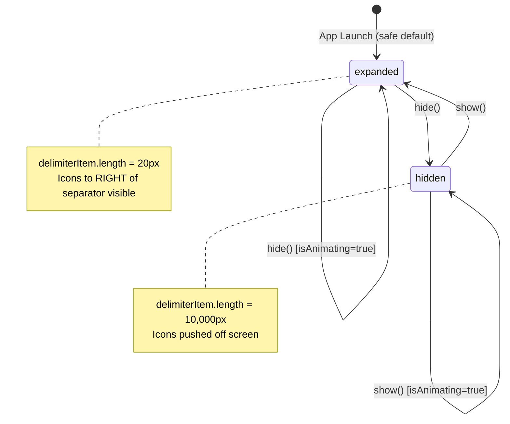

### State Details

| State | Delimiter Length | Effect |
|-------|------------------|--------|
| `expanded` | 20px | All icons visible |
| `hidden` | 10,000px | Icons RIGHT of delimiter pushed off-screen |

### Transitions

| From | To | Trigger | Guards |
|------|-----|---------|--------|
| `expanded` | `hidden` | `hide()`, `toggle()` | `!isAnimating`, `delimiterItem != nil` |
| `hidden` | `expanded` | `show()`, `toggle()` | `!isAnimating`, `delimiterItem != nil` |

### Auto-Rehide Timer

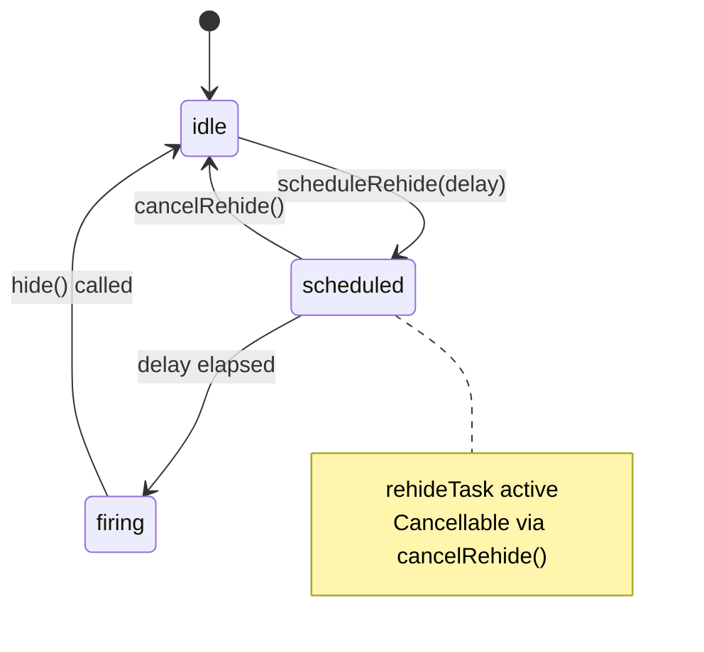

---

## 2. SearchWindowController

Simple window visibility state.

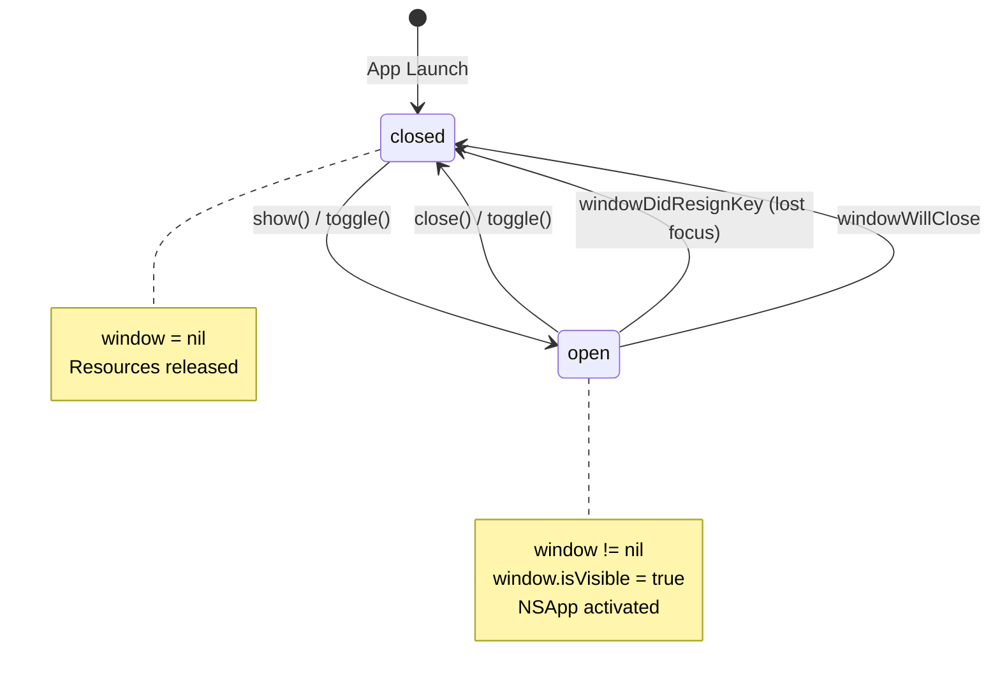

### State Details

| State | Window | Behavior |
|-------|--------|----------|
| `closed` | `nil` | No resources allocated |
| `open` | `NSWindow` | Floating, centered below menu bar |

### Key Behaviors
- **Fresh window on each show**: `createWindow()` called every time to reset state
- **Auto-close on focus loss**: `windowDidResignKey` triggers `close()`
- **Floating level**: `window.level = .floating`

---

## 3. AccessibilityService

Permission monitoring + cache management.

### Permission State Machine

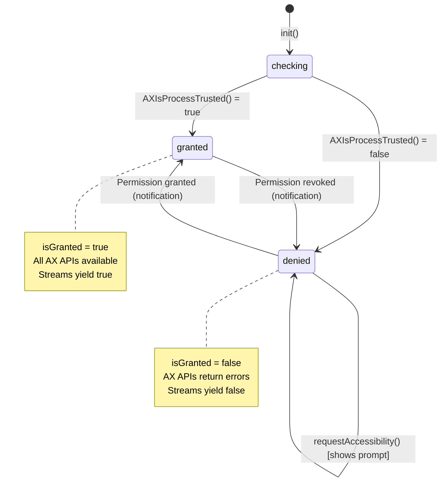

### Permission Monitoring Flow

```
DistributedNotificationCenter
        │
        ▼
  com.apple.accessibility.api
        │
        ▼ (250ms delay)
  checkAndUpdatePermissionStatus()
        │
        ▼
  AXIsProcessTrusted()
        │
        ├── Changed? ──► Update isGranted + notify streams
        │
        └── Same? ────► No-op
```

### Cache State Machine

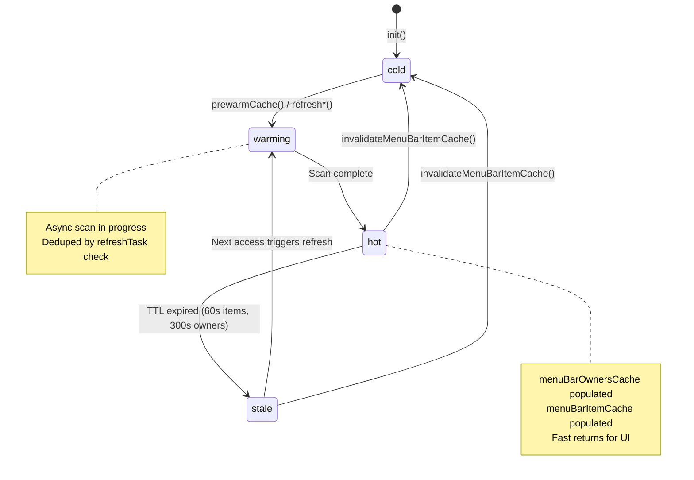

### Cache TTLs

| Cache | TTL | Purpose |
|-------|-----|---------|
| `menuBarOwnersCache` | 300s (5 min) | App list for Find Icon |
| `menuBarItemCache` | 60s (1 min) | Positions for hide/show |

---

## 4. MenuBarManager (Orchestrator)

Central coordinator that ties all services together.

### Initialization State Machine

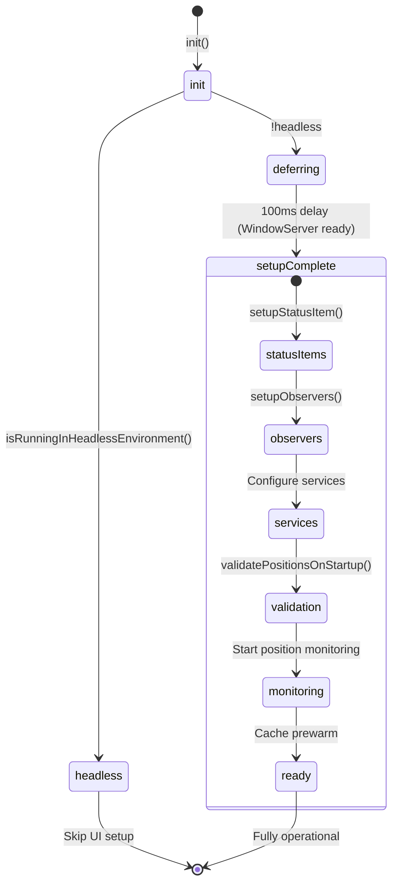

### Position Validation State Machine

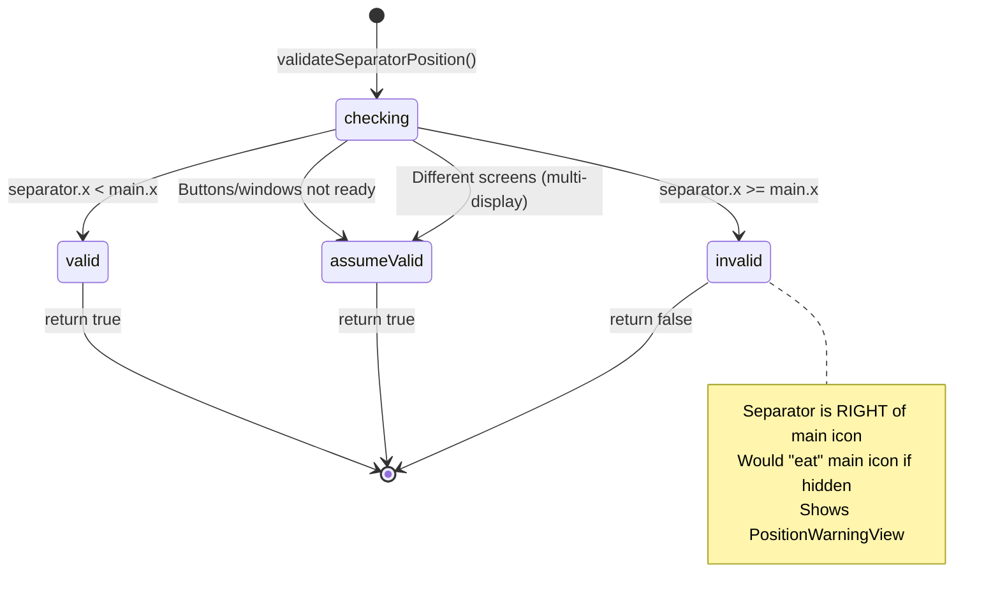

### Continuous Position Monitoring

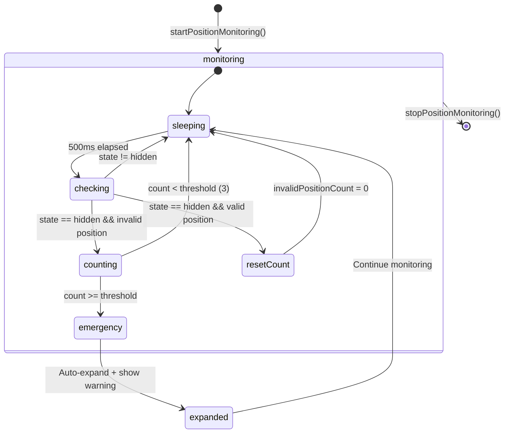

### Toggle Hidden Items Flow

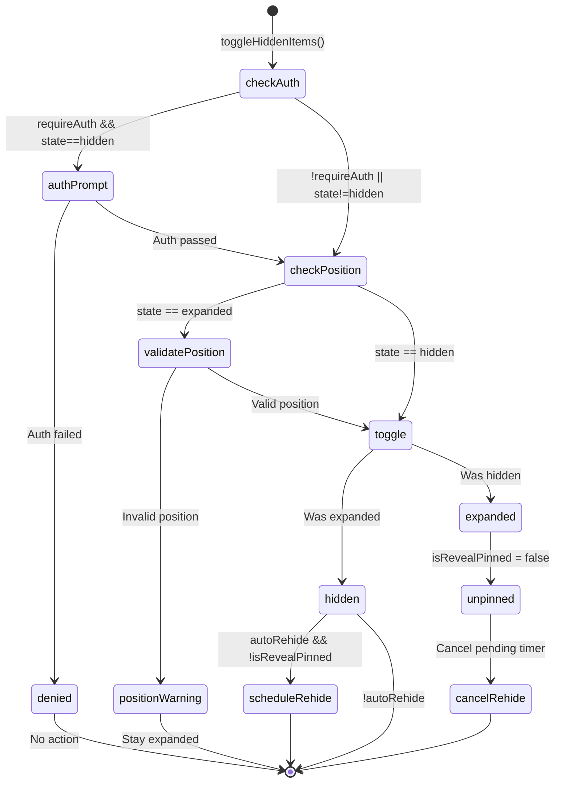

### Reveal Pinning Logic

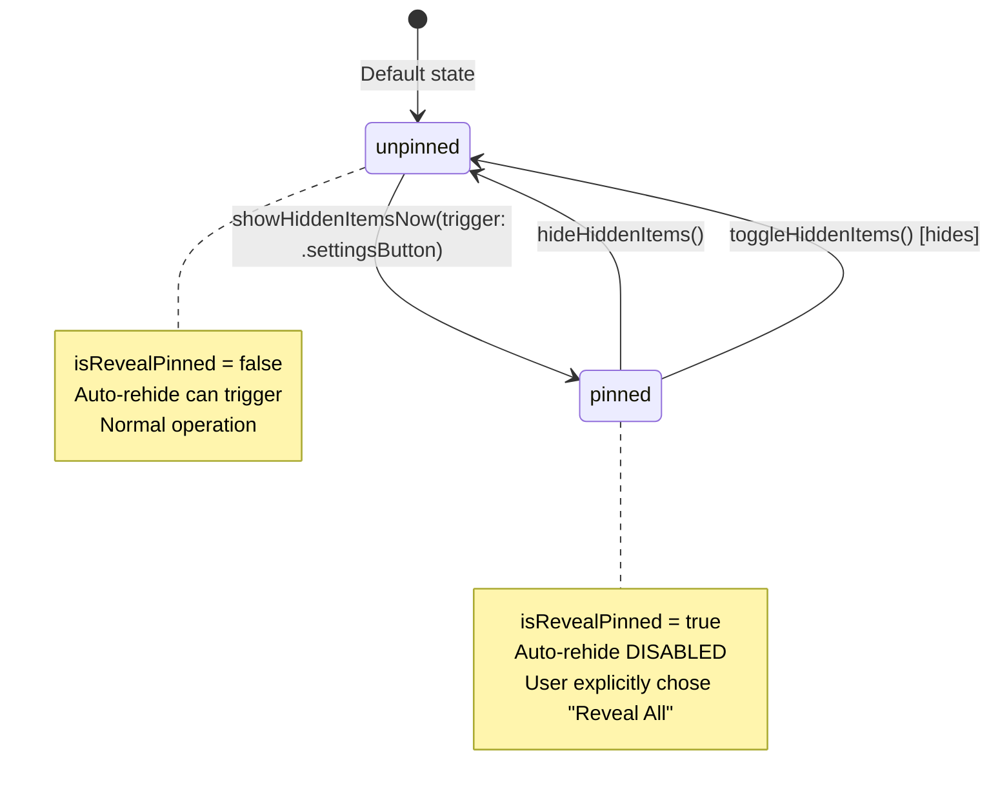

---

## 5. PersistenceService

Simple file-based storage, no complex state machine.

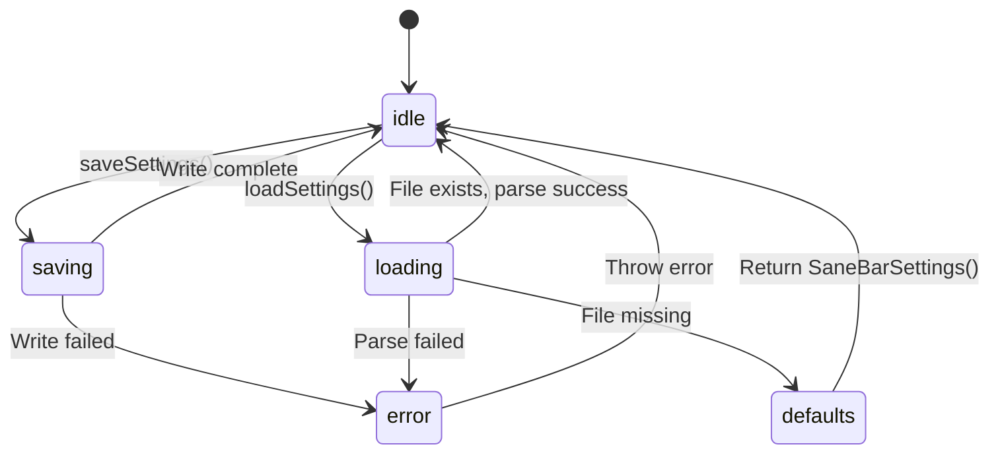

### File Locations

| File | Path | Purpose |
|------|------|---------|
| Settings | `~/Library/Application Support/SaneBar/settings.json` | Main settings |
| Profiles | `~/Library/Application Support/SaneBar/profiles/*.json` | Icon profiles |

---

## Edge Cases Identified

### 1. Multi-Display Position Validation
**Problem**: Separator on external display, main on built-in - coordinates not comparable.
**Solution**: Skip validation if `mainWindow.screen != separatorWindow.screen` (line 475-478 in MenuBarManager.swift)

### 2. Race During Icon Drag
**Problem**: User dragging icons triggers brief invalid positions.
**Solution**: Debounce with `invalidPositionCount` - only trigger after 3 consecutive failures (1.5s)

### 3. Headless Environment Crash
**Problem**: CI/test environments have no WindowServer.
**Solution**: `isRunningInHeadlessEnvironment()` check skips all UI setup

### 4. WindowServer Not Ready on Boot
**Problem**: Login items launch before GUI is ready (Mac Mini M4).
**Solution**: 100ms `deferredUISetup()` delay before creating status items

### 5. Cache Thundering Herd
**Problem**: Multiple simultaneous cache refreshes on cold cache.
**Solution**: `menuBarOwnersRefreshTask` / `menuBarItemsRefreshTask` deduplication - second caller awaits first

### 6. Permission Change During Operation
**Problem**: User revokes permission mid-scan.
**Solution**: All AX calls check `isTrusted` first, return empty/false gracefully

---

## Service Dependencies

```
                    ┌─────────────────────┐
                    │   MenuBarManager    │
                    │   (Orchestrator)    │
                    └─────────┬───────────┘
                              │
        ┌─────────────────────┼─────────────────────┐
        │                     │                     │
        ▼                     ▼                     ▼
┌───────────────┐   ┌─────────────────┐   ┌─────────────────┐
│ HidingService │   │ AccessibilityS. │   │ PersistenceS.   │
│               │   │                 │   │                 │
│ - state       │   │ - isGranted     │   │ - saveSettings  │
│ - toggle/show │   │ - permStream    │   │ - loadSettings  │
│ - hide        │   │ - cache mgmt    │   │ - profiles      │
└───────┬───────┘   └────────┬────────┘   └─────────────────┘
        │                    │
        │                    ▼
        │           ┌─────────────────┐
        │           │  AXUIElement    │
        │           │  (System API)   │
        │           └─────────────────┘
        │
        ▼
┌───────────────┐
│ NSStatusItem  │
│ (System API)  │
│ .length prop  │
└───────────────┘
```

---

## 6. Concurrency Model

### Thread Isolation

| Component | Isolation | Rationale |
|-----------|-----------|-----------|
| `MenuBarManager` | `@MainActor` | All UI operations |
| `HidingService` | `@MainActor` | NSStatusItem manipulation |
| `AccessibilityService` | `@MainActor` | Published properties for SwiftUI |
| `SearchWindowController` | `@MainActor` | NSWindow lifecycle |
| `PersistenceService` | `@unchecked Sendable` | File I/O is synchronous, no shared mutable state |

### Async Boundaries

```
┌──────────────────────────────────────────────────────────────────┐
│                        MAIN ACTOR                                 │
│  ┌─────────────┐  ┌─────────────┐  ┌─────────────────────────┐   │
│  │ MenuBar     │  │ Hiding      │  │ Accessibility           │   │
│  │ Manager     │  │ Service     │  │ Service                 │   │
│  └──────┬──────┘  └──────┬──────┘  └───────────┬─────────────┘   │
│         │                │                     │                  │
└─────────┼────────────────┼─────────────────────┼──────────────────┘
          │                │                     │
          ▼                ▼                     ▼
    ┌───────────┐    ┌───────────┐    ┌─────────────────────────┐
    │DispatchQ  │    │ Task      │    │ Task.detached           │
    │.main.after│    │ (rehide)  │    │ (priority: .utility)    │
    │(deferred  │    │           │    │                         │
    │ setup)    │    │           │    │ scanMenuBarOwnerPIDs()  │
    └───────────┘    └───────────┘    │ scanMenuBarAppMinX()    │
                                      └─────────────────────────┘
```

### Task Lifecycle

| Task | Owner | Cancellation | Cleanup |
|------|-------|--------------|---------|
| `permissionMonitorTask` | AccessibilityService | On deinit | Continuations finished |
| `rehideTask` | HidingService | `cancelRehide()` | Set to nil |
| `positionMonitorTask` | MenuBarManager | `stopPositionMonitoring()` | Set to nil |
| `menuBarOwnersRefreshTask` | AccessibilityService | `invalidateMenuBarItemCache()` | Set to nil |
| `menuBarItemsRefreshTask` | AccessibilityService | `invalidateMenuBarItemCache()` | Set to nil |

### Race Condition Mitigations

| Race | Scenario | Mitigation |
|------|----------|------------|
| Double-toggle | User clicks rapidly | `isAnimating` guard in show()/hide() |
| Cache refresh | Multiple callers | Task deduplication - await existing task |
| Permission check | Notification vs direct check | 250ms delay after notification |
| Position validation | During icon drag | 3-check debounce (1.5s) |
| Window creation | Multiple show() calls | `window?.orderOut(nil)` before creating new |

---

## 7. Error Handling Matrix

### HidingService

| Operation | Error Condition | Handling | User Impact |
|-----------|-----------------|----------|-------------|
| `toggle()` | `delimiterItem == nil` | Log error, return | Nothing happens |
| `show()` | `isAnimating == true` | Early return | Ignored |
| `hide()` | `isAnimating == true` | Early return | Ignored |

### AccessibilityService

| Operation | Error Condition | Handling | User Impact |
|-----------|-----------------|----------|-------------|
| `clickMenuBarItem()` | Not trusted | Log, return false | Click fails |
| `clickMenuBarItem()` | App not running | Log, return false | Click fails |
| `listMenuBarItemOwners()` | Not trusted | Return `[]` | Empty list |
| `AXUIElementCopyAttributeValue` | Any AXError | Continue to next | Item skipped |
| `permissionStream` | Continuation terminated | Remove from dict | Stream ends |

### MenuBarManager

| Operation | Error Condition | Handling | User Impact |
|-----------|-----------------|----------|-------------|
| `validateSeparatorPosition()` | Windows not ready | Return true (assume valid) | May hide incorrectly on first launch |
| `validateSeparatorPosition()` | Different screens | Return true (skip check) | Multi-display works |
| `authenticate()` | Policy unavailable | Try fallback policy | May fail on old Macs |
| `checkForUpdates()` | Network error | Show error alert | User informed |

### PersistenceService

| Operation | Error Condition | Handling | User Impact |
|-----------|-----------------|----------|-------------|
| `loadSettings()` | File missing | Return defaults | Fresh start |
| `loadSettings()` | Parse error | Throw | Caller handles |
| `saveSettings()` | Write error | Throw | Settings lost |
| `saveProfile()` | Limit reached (50) | Throw `limitReached` | User informed |

---

## 8. Notifications (Events)

### Sent by SaneBar

| Notification | Sender | When | Payload |
|--------------|--------|------|---------|
| `SaneBar.hiddenSectionShown` | HidingService | After show() completes | None |
| `SaneBar.hiddenSectionHidden` | HidingService | After hide() completes | None |

### Received by SaneBar

| Notification | Listener | Source | Action |
|--------------|----------|--------|--------|
| `com.apple.accessibility.api` | AccessibilityService | System (DistributedNotificationCenter) | Recheck permission |

---

## 9. External System API Calls

### Accessibility Framework (ApplicationServices)

| API | Used In | Purpose | Can Fail |
|-----|---------|---------|----------|
| `AXIsProcessTrusted()` | AccessibilityService | Check permission | No (returns bool) |
| `AXIsProcessTrustedWithOptions()` | AccessibilityService | Request with prompt | No (returns bool) |
| `AXUIElementCreateApplication()` | AccessibilityService | Get app element | No (always returns) |
| `AXUIElementCreateSystemWide()` | Not used | - | - |
| `AXUIElementCopyAttributeValue()` | AccessibilityService | Read AX attributes | Yes (AXError) |
| `AXUIElementPerformAction()` | AccessibilityService | Click menu bar items | Yes (AXError) |
| `AXUIElementCopyActionNames()` | AccessibilityService | List available actions | Yes (AXError) |
| `AXValueGetValue()` | AccessibilityService | Extract CGPoint/CGSize | Yes (returns bool) |

### AppKit

| API | Used In | Purpose |
|-----|---------|---------|
| `NSStatusBar.system.statusItem()` | StatusBarController | Create menu bar items |
| `NSStatusItem.length` | HidingService | Toggle visibility |
| `NSWindow` | SearchWindowController | Floating search UI |
| `NSPopover` | MenuBarManager | Onboarding, warnings |
| `NSMenu` | MenuBarManager | Context menu |
| `NSWorkspace.shared.runningApplications` | AccessibilityService | Enumerate apps |
| `NSRunningApplication` | AccessibilityService | App metadata |

### CoreGraphics (CGEvent)

| API | Used In | Purpose |
|-----|---------|---------|
| `CGEvent(mouseEventSource:...)` | AccessibilityService | Cmd+drag for icon moving |
| `CGEvent.post(tap:)` | AccessibilityService | Inject mouse events |

### LocalAuthentication

| API | Used In | Purpose |
|-----|---------|---------|
| `LAContext.evaluatePolicy()` | MenuBarManager | Touch ID / password auth |
| `LAContext.canEvaluatePolicy()` | MenuBarManager | Check biometric availability |

### Foundation

| API | Used In | Purpose |
|-----|---------|---------|
| `FileManager` | PersistenceService | File I/O |
| `JSONEncoder/Decoder` | PersistenceService | Settings serialization |
| `DistributedNotificationCenter` | AccessibilityService | System-wide notifications |
| `NotificationCenter` | HidingService | App-internal notifications |

---

## 10. Entry/Exit Actions

### HidingService States

| State | On Enter | On Exit |
|-------|----------|---------|
| `expanded` | Set `delimiterItem.length = 20` | - |
| | Post `.hiddenSectionShown` | |
| | Invalidate AX cache | |
| `hidden` | Set `delimiterItem.length = 10000` | - |
| | Post `.hiddenSectionHidden` | |
| | Invalidate AX cache | |

### AccessibilityService Permission States

| State | On Enter | On Exit |
|-------|----------|---------|
| `granted` | Set `isGranted = true` | - |
| | Yield `true` to all streams | |
| | Log "GRANTED" | |
| `denied` | Set `isGranted = false` | - |
| | Yield `false` to all streams | |
| | Log "REVOKED" | |

### SearchWindowController States

| State | On Enter | On Exit |
|-------|----------|---------|
| `open` | Create fresh NSWindow | - |
| | Position centered below menu bar | |
| | `makeKeyAndOrderFront` | |
| | `NSApp.activate` | |
| `closed` | `window.orderOut(nil)` | - |
| | Set `window = nil` | |

---

## 11. Invariants (Must Always Be True)

| Invariant | Enforced By | Violation Impact |
|-----------|-------------|------------------|
| `delimiterItem != nil` when operating | Guard in show()/hide()/toggle() | Operation silently fails |
| `isAnimating` prevents concurrent transitions | Guard at top of show()/hide() | Double-toggle prevented |
| Separator LEFT of main icon when hidden | Position validation + monitoring | Auto-expand + warning |
| Only one refresh task per cache | Task deduplication check | Prevents thundering herd |
| Permission streams cleaned up | `onTermination` closure | No memory leaks |
| Settings file is valid JSON | Try/catch in load | Falls back to defaults |

---

## 12. Security Considerations

| Concern | Mitigation | Notes |
|---------|------------|-------|
| Accessibility permission scope | Only reads/clicks menu bar | No keyboard logging, no screen capture |
| CGEvent injection | User-initiated only | Cmd+drag for icon rearrangement |
| Settings file tampering | In `~/Library/Application Support` | User-writable by design |
| Touch ID bypass | Optional feature, not security boundary | Convenience feature only |
| Update check privacy | Off by default | User must opt-in |

---

## 13. Test Coverage Checklist

### State Transitions to Test

- [ ] HidingService: expanded → hidden → expanded cycle
- [ ] HidingService: Rapid toggle (isAnimating guard)
- [ ] HidingService: Auto-rehide timer fires
- [ ] HidingService: Auto-rehide cancelled by manual hide
- [ ] SearchWindow: Open → focus loss → closed
- [ ] SearchWindow: Rapid open/close
- [ ] AccessibilityService: Permission granted mid-session
- [ ] AccessibilityService: Permission revoked mid-session
- [ ] AccessibilityService: Cache prewarm races with manual refresh
- [ ] MenuBarManager: Position validation pass → hide
- [ ] MenuBarManager: Position validation fail → stay expanded
- [ ] MenuBarManager: Multi-display position skip
- [ ] MenuBarManager: Continuous monitoring emergency trigger
- [ ] PersistenceService: Missing file → defaults
- [ ] PersistenceService: Corrupt file → error
- [ ] PersistenceService: Profile limit (50)

### Edge Cases to Test

- [ ] Headless environment (CI)
- [ ] WindowServer not ready (Login Item)
- [ ] App quit during animation
- [ ] App quit during cache refresh
- [ ] Icon drag during position monitoring
- [ ] External display connect/disconnect
